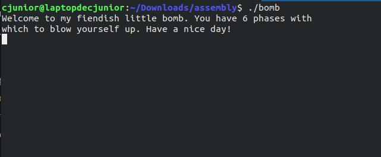
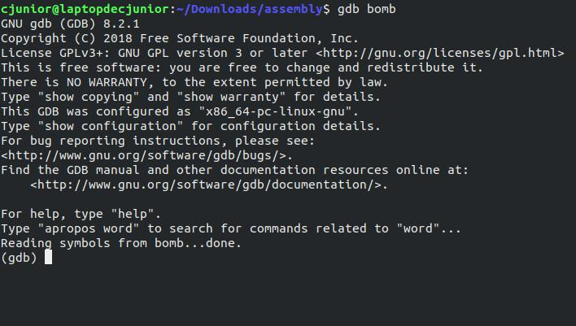
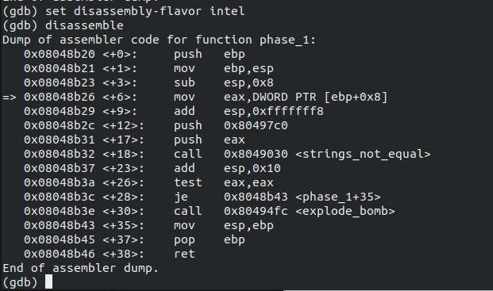
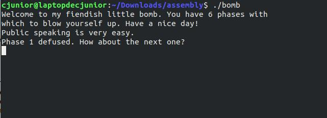

# Solving Binary Bomb Lab challenges

For the past month or so, I've been working on solving the infamous Binary Bomb Lab challenges. The challenge is made to teach the users understand assembly language.
&nbsp;

## Introduction
So, the 'Binary Bomb', made by the nefarious Dr Evil, is provided as an object code file and when run, it prompts the user to type in 6 strings, in the six phases. If any of these is incorrect, the bomb "**explodes**" and exits gracefully.
&nbsp;

One must "**defuse**" the bombs by disassembling and reverse engineering the program to determine what the 6 strings could be.

Solving the Bomb Lab has been fun, exciting and extremely informational.
&nbsp;

So, let's jump in!

## Setting up

You'll have to know the basics of x86 assembly language. For that SecurityTube's [Assembly Primer for hackers](https://www.youtube.com/watch?v=K0g-twyhmQ4&list=PL6brsSrstzga43kcZRn6nbSi_GeXoZQhR)
is a great place to start.
&nbsp;

You can get the file and read the lab handout and learn a bit about the commands we are about to use [here](http://csapp.cs.cmu.edu/2e/bomblab.pdf).

We'll be debugging using GDB, GNU Project debugger, which you can install from [here](https://www.gnu.org/s/gdb/).

## Phase 1

First, let's run the program, which will prompt the user to input the first password.

**Let's reverse!**

For that, we load the program up in GDB.

&nbsp;

First, let's set a breakpoint at **`<phase_1>`**, so that the bomb doesn't blow up when we run the program inside GDB. 

Set the breakpoint by the command **`break phase_1`** and **`run`** the program.

Just add a word as as password and continue.

Now, as you can see, the breakpoint has broken the curses of Dr Evil and saved us from the explosion. 

Now, let us **disassemble**.

GDB will now dump the assembler code of phase_1.

Okay, so there you go, now you know what's happenning under the hood.

Upon examination, we can come to a vague conclusion that, in a nutshell, the string 
is moved into `eax` (at line `<+6>`) and along with something from the mysterious memmory address **0x80497c0**, and is pushed into the function `<strings_not_equal>` (at line `<+18>`)

We can see a comparison going on at line `<26>`, which, if equal, makes the program jump to line `<+35>`, over the call to the function `<explode_bomb>`, saving our computer from the Dr Evil 's harm.

Assuming that `<strings_not_equal>` is just checking the equality of strings, in `<phase_1>`, a string is entered, checked whether it is equal to the stuff at `0x80497c0`, and if it is, the program exits.

&nbsp;

So let's check out what's in there at `0x80497c0`.

We'll use the `x` command, and print it as a string.

Now, let's see what Dr Evil has to say.

Let's enter that as the password.

And there you go!

Phase 1 - solved!
