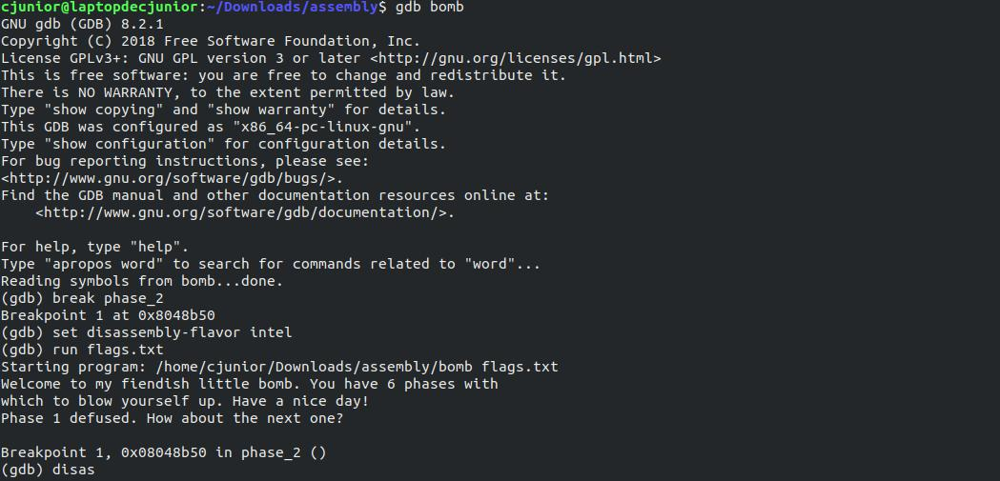
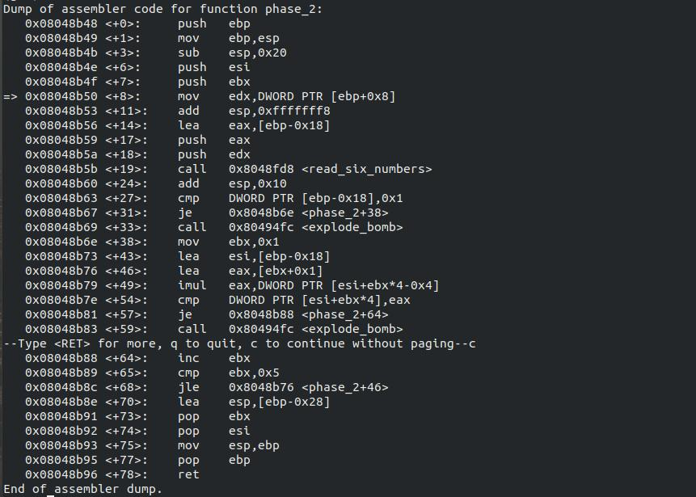
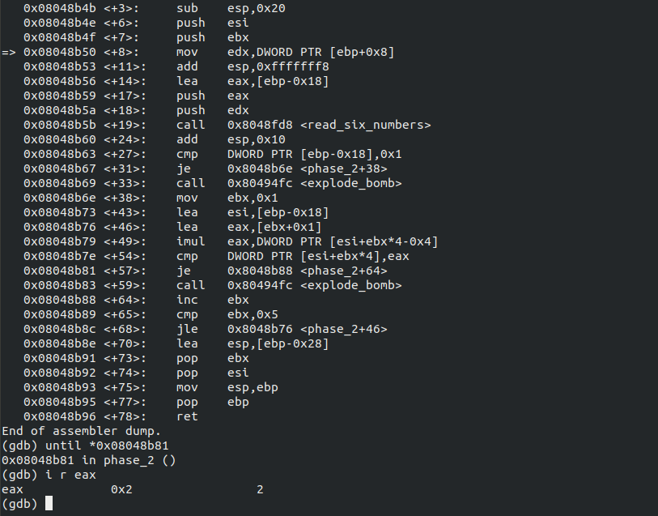

# Solving Binary Bomb Lab challenges

Hello!  

Here, we're going to solve Phase-2 of the Bomb Lab.

If you were looking for some other phases, click on the link below.

  * [Phase -1](https://officialcjunior.github.io/Binary-Bomb-Lab-Phase-1/)

_________________

Okay, let's jump in.

After loading the file up in GDB, let's set the breakpoint at **`phase_2`** and run **`disas`** to see what's under the hood.

&nbsp;

&nbsp;

**Let's reverse!**

&nbsp;

We can see that, in line `<+19>`, after setting up some memory, function **`<read_six_numbers>`** is called. From this, we can assume that Dr Evil wants us to enter some six integers. 

Secondly, on line `<+68>`, we can see a instruction tell you to jump back to line `+46` until `$ebx` is 5, which is a loop. And on line `<+54>`, there's a `cmp` statement which lets us jump over the call to `<explode_bomb>`. 

From this, we can come to a conclusion that, the numbers are in some form of a pattern and each integer must satisfy a condition to avoid setting the bomb off.

_________________

After checking whether the first integer is 1 or not at line `<+27>`, we are jumping to line `<+38>`, where the heart of `phase_2` is.

And let's use `until` to move till line `<+54>` to see, to what we're comparing the second integer with. As we're comparing it with `$eax`, let's see what's inside that register.

So, the second integer must be 2.

Similary, we can keep going to the next iteration using the command `ni` on and on again till the last integer is compared and form the password. But where's the fun in that?

_________________

While the program is on line `<+49>`, we have all of our integers' addresses inside `$esi` and we have `$ebx`, which just keeps incrementing by 1, each iteration, till the end. 

That is, each element except the first element should be the previous element times the index of the current element, added by 1.

Which is equivalent to,
>element[i]=(i+1)*element[i-1]

So, our second password is 

**`1 2 6 24 120 720`**

And there you go!

Phase -2, solved.
