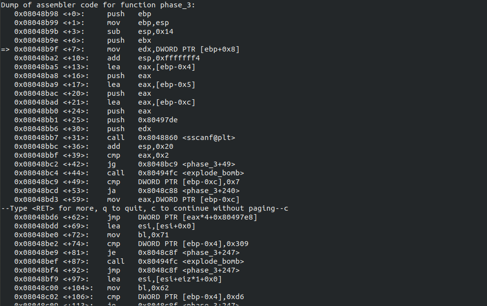
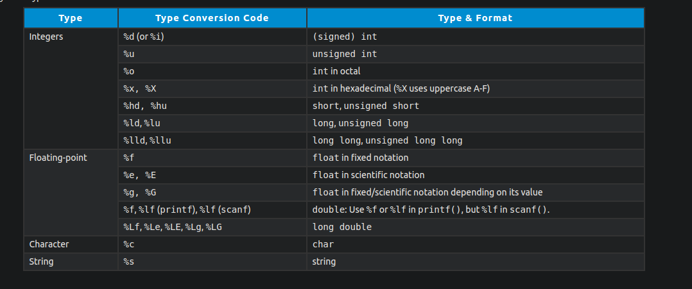

Hello!

Here, we're going to solve Phase-2 of the Bomb Lab.

If you were looking for some other phases, click on the link below.

  * [Phase -1](https://officialcjunior.github.io/Binary-Bomb-Lab-Phase-1/)
  * [Phase -2](https://officialcjunior.github.io/Binary-Bomb-Lab-Phase-2/)

_________________

As usual, we set up a breakpoint at `phase_3` after loading it on GDB.`run` it and `disassemble` it.

&nbsp;

Woah!

That's a lot of code.

But don't lose hope, it's easier than it looks!

_________________

The first interesting that we see here is at line `<+31>` where `scanf` function is called, along with one peculiar memory address along with it.

So, let's see what's inside it.

For that we use the `x` command and print whatever inside it, as strings, hence the `/s`

If you've had spent some time learning C, you'd know what this means. 

Even if you haven't, I've got you covered.

So, Dr Evil wants us to enter a character sandwiched between two integers.

Let's update our test input with '`1 a 2`' 
 and `run` it up again.

_________________

We have already jumped over the first call to `<explode_bomb>` at line `+39` as we've entered some value into the three variables in `scanf`.

We have the second condition at `<+49>`, where we are jumping to line `<240>`, (where the bomb explodes), if the first number is above 7.

Then, from `<+69>`, you can see something which looks like a cased structure.

Upon close examination, you'll be able to realize that there are multiple answers to this phase. There are different cases and comparisons, if we enter any number between 0 and 7 as the first input.

For the sake of simplicity, let's take the case which comes first, which is the one where if we had entered 1 as the first integer.

_________________

At line `<+73>` and `<+72>`, we are comparing the second integer with 0x309 and moving 0x71 to a variable `bl`. 0x309 is **777** in hexademical form and 0x71 is 113, which points to letter **q** in ASCII.

`jmp`-ing to line `<+247>`, we can see that `bl` is compared to the character we had entered and then jumped over `<explode_bomb>`, if `ZF` is 1 at line `<250>`.

So, our password ends up being  **`0 q 777`**.

&nbsp;
And there you go, Phase -2 is done!

And I think we should consider joining a bomb squad.
